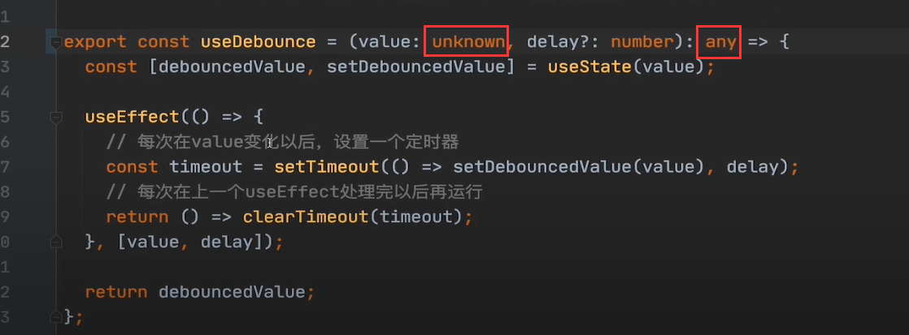
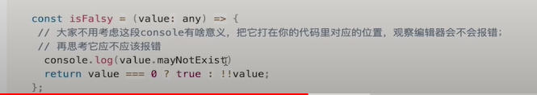
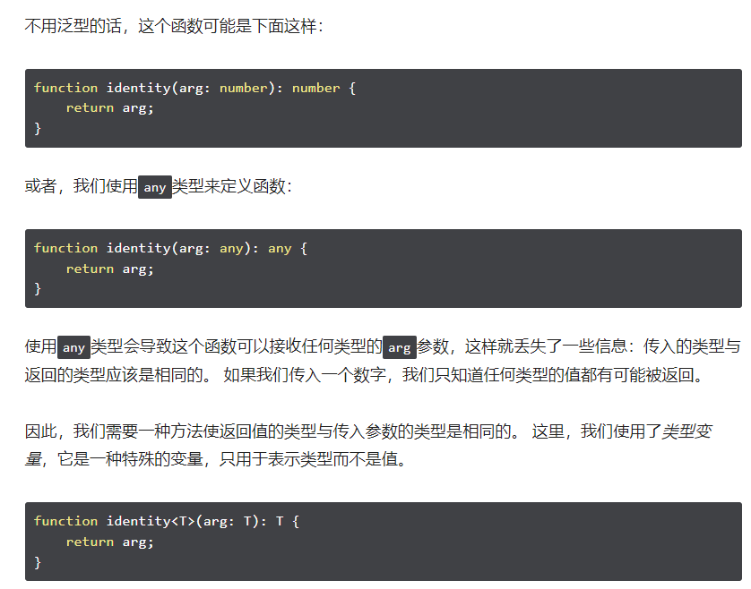
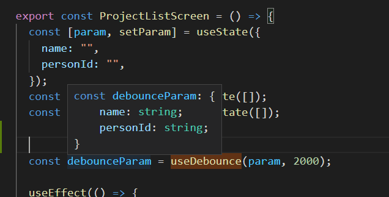

# 项目需要实现的功能

- 
- 技术栈
  - 
  - 
  - 
  - 
  - 
  - 
  - 


# 初始化项目

## 用Create React App 初始化项目

- 官网有介绍。

- 我们需要创建的是Typescript项目

  - ```javascript
    npx create-react-app jira --template typescript
    // 使用不同的包管理器创建项目，没尝试
npx create-react-app jira --template typescript --use-npm
    npx create-react-app jira --template typescript --use-npm
    ```
  ```
    
  - 使用上面命令一直报错，查了stackoverflow，找到一个解决方案。npx clear-npx-cache，再重新执行方案。
  ```
  
- scr目录

  - index.tsx文件是做一些准备工作，APP.tsx 是做app本身的东西。
  - react-app-env.d  这个是引入一些预先定义好typescrpt的类型

- public文件夹是不参与打包的，它里面包含了真正的静态文件。

- manifest 是用来做PWA的,配置PWA

- package.json是每个前端项目的入口文件


## 配置eslint、prettier和commitlint规范

### tsconfig.json配置

- compilerOptions中配置baseUrl,目的是引入文件的时候如果写了绝对路径，它会自动从配置的地址目录中找
  - 配置 compilerOptions
    
  - 我们的绝对路径会去src下面寻找
    
- 将 strict 改为false，不然后面写函数的时候，函数参数下面一直会有红色波浪线

### 如何确保编辑我们项目的人都能采用统一的格式化配置呢--prettier

- [项目中使用prettier配置链接](https://prettier.io/docs/en/install.html)

- 使用步骤

  - ```javascript
    1.安装依赖
     yarn add --dev --exact prettier
    2.新建一个配置文件，echo就是新建文件的意思
     echo {}> .prettierrc.json
    3.创建一个.prettierignore文件（不需要格式化的文件，在项目旁边悬浮的新建文件创建），并输入
        build
        coverage
    4.
    ```

  - yarn prettier --write . 是手动格式化，当然，我们希望我们的项目是自动格式化，需要借助 Pre-commit Hook,就是当我们代码提交前，就自动对其格式化。 即代码commit前，触发husky钩子，运行lint-staged命令，格式化项目。

    - 

    - 步骤 [npx mrm@2 lint-staged报错解决](https://typicode.github.io/husky/#/?id=custom-directory)，[github解决方案](https://github.com/okonet/lint-staged/issues/961)

      [eslint-config-prettier 依赖地址](https://prettier.io/docs/en/install.html#eslint-and-other-linters)

      ```javascript
      1. 安装 husky and lint-staged 依赖
      	npx mrm@2 lint-staged 
      	此命令会出现.git can't found 报错,原因是package.json文件与 .git 不在同一目录下，不同层级，参考官网提示（在步骤后面的地址中）。
      	修改package.json中scripts的prepare("prepare": "cd .. && husky install jira/.husky"),
      2. 修改scripts后，需要执行 yarn 或者 npm install,运行scripts 中的prepare,会在目录下面生成 .husky文件夹
      3.在 .husky文件夹下面新建文件 pre-commit,文件中输入以下命令 （不需要运行npx mrm@2 lint-staged 这个命令）
      	#!/bin/sh
          . "$(dirname "$0")/_/husky.sh"
          cd pathToYourProject && npx lint-staged
      4. 增加对ts、tsx文件的格式化，修改package.json中的 'lint-staged'命令
      	"*.{js,css,md,ts,tsx}": "prettier --write"	
      5. 最后一步，create react app 是自带eslint配置，在package.json 中 eslintConfig 。prettier和eslint一起工作的时候会冲突，所以需要专门对eslint配置以下，安装一下依赖。文档在prettier官网-Usage-install 目录第二条。
      	yarn add eslint-config-prettier -D 
      6.修改 eslintConfig 中的配置，添加 prettier，意思是用 prettier 覆盖了一部分原来的规则
      	"eslintConfig": {
              "extends": [
                "react-app",
                "react-app/jest",
                "prettier"
              ]
        	},
            
      	
      ```

      

    - commitlint规范 （目的是 每次 git commit的时候，对commit message进行校验，查看是否符合一定的规范，如果不符合，提交失败）

    - 配置步骤 [commitlint github文档--Getting started](https://github.com/conventional-changelog/commitlint)

      ```javascript
      1. 安装对应的系统依赖并创建文件（可以使用yarn add，但是yarn add commitlint/config-conventional 没有这个模块，必须使用npm install这个模块  echo文件的时候需要去掉引号，官网有问题）
      	# Install commitlint cli and conventional config
          npm install --save-dev @commitlint/{config-conventional,cli}
          # For Windows:
          npm install --save-dev @commitlint/config-conventional @commitlint/cli
      
          # Configure commitlint to use conventional config
          echo module.exports = {extends: ['@commitlint/config-conventional']} > commitlint.config.js
      
      2. 在husky文件夹下面创建 commit-msg文件，添加下面话或者其他，看文档
      	#!/bin/sh
          . "$(dirname "$0")/_/husky.sh"
      
          cd jira && npx --no -- commitlint --edit $1 或者 cd jira && npx commitlint --edit $1 等等
      3. 文档中 Shared configuration 下 config-conventional 就是 commit 的规则
      	
      ```
    ```
    
    - git commit 的时候报错（对应步骤第二点完成后提交）
    
      报错信息演示
    
      
    
        - 提交的规则（fix: some message）
        
    ```
          [
            'build', 
            'chore',
            'ci',
            'docs',  // 指更新了文档
            'feat', // 指 这一次添加了新的功能
            'fix',
            'perf', // 指这一次提升了性能
            'refactor',
            'revert',
            'style',   // 改进了样式
          'test'	// 增加了测试脚本
        ];
        ```
    
      
    
    
    
    
    
    ​    
    
    - 


## 对比常见mock方案，配置JSON SERVER

### 常见Mock方案

- 代码侵入（直接在代码中写死Mock数据，或者请求本地的JSON文件）

  - 优点：无

  - 缺点：

    1.和其他方案比Mock效果不好

    2.与真实Server环境的切换非常麻烦，一切需要侵入代码切换环境的行为都是不好的

- 请求拦截

  - 代表：[Mock.js](https://github.com/nuysoft/Mock/wiki/Getting-Started)
    原理是重写xmlHttpRequest的一些属性，然后帮助门额返回我们想要的数据
  - 实例：
  - 优点：
    - 与前端代码分离
    - 可生成随机数据
  - 缺点：
    - 数据都是动态生成的假数据，无法真是模拟真删改查的情况
    - 只支持ajax,不支持fetch
  - 

- 接口管理工具

  - 代表：rap(阿里出品)、swagger、moco、yapi

  - 优点：

    1.配置功能强大，接口管理与Mock一体，后端修改接口Mock也跟着改，可靠

  - 缺点：
    1.配置复杂，依赖后端，可能会出现后端不愿意出手，或者等配置完了，接口也开发出来了的情况。

  - 一般会作为大团队的基础建设而存在，没有这个条件的话慎重考虑

- 本地Node服务器

  - 代表：[json-server](https://github.com/typicode/json-server)
  - 优点：
    1. 配置简单，json-server甚至可以0代码30秒启动一个REST API Server
    2. 自定义程度高，一切尽在掌握中
    3. 增删改查真是模拟
  - 缺点：
    1. 与接口管理工具相比，无法随着后端API的修改而自动修改
  - 在这2章里面会接触到不同的（GET、POST 、DELETE 、 PATCH）Mock场景，

- 

- REST API

  - 一句话总结：URI代表资源/对象, METHOD代表行为

    ```javascript
    GET /tickets  //列表
    GET /tickets/12  //详情
    POST /tickets  //增加
    PUT /tickets/12  //替换
    PATCH /tickets/12  //修改
    DELETE /tickets/12  //删除
    ```

    

### JSON SERVER使用

- 步骤（参考官网）

  ```javascript
  1. Install JSON Server
  
  	npm install -g json-server 或者 yarn add json-server -D
  
  2. Create a db.json file with some data（创建一个json文件，起名叫db.json，文件放置在跟index.html平级的目录中，也可以放置在static文件夹中，db.json文件里面的内容，是一个对象。）
  
      {
        "posts": [
          { "id": 1, "title": "json-server", "author": "typicode" }
        ],
        "comments": [
          { "id": 1, "body": "some comment", "postId": 1 }
        ],
        "profile": { "name": "typicode" }
      }
  
  3. Start JSON Server
  
  	json-server --watch db.json
  
  4. Now if you go to http://localhost:3000/posts/1, you'll get
  
  	{ "id": 1, "title": "json-server", "author": "typicode" }
  ```

  - 运行完之后会生成对应的resource，可以去postman测试一下
    

    

  - 

- 项目中使用

  - 创建 __json_server_mock__  文件夹 前后有两个空格，告诉看代码的人，这个文件夹和我们项目本身没什么关系，起辅助作用。创建db.json

    - value 必须是数组或者对象
      

  - 然后在package.json中 scripts 下添加命令

    - "json-server":"json-server __json_server_mock__/db.json --watch"

      

    - 尝试一下启动

      npm run json-server

    - json-server与项目运行后是一个端口，修改json-server的端口
      "json-server":"json-server __json_server_mock__/db.json --watch --port 3001"

    - 

  - 

- 


# React 自定义hook和状态提升分享组件状态


  


## 查询骑手demo

- encodeURIComponent（转义） 和 decodeURIComponent (解码)

- 
- encodeURI 可以转义整个url

- 创建对应的组件,但是search-panel组件里面的状态没有提升，根据项目名改变，请求list的接口放在了searchPanel里面，List组件如何获取呢？react文件虽然不使用React,但是一定要引入 （imort React from 'react'）

  - 

  - 

  - ```javascript
    import React from 'react';
    import {useEffect, useState} from 'react';
    
    export const SearchPanel = () =>{
      const [param,setParam] = useState({
        name:'',
        personId:''
      })
    
      const [users,setUsers] = useState([])
      const [list,setList] = useState([]) 
    
      useEffect(() => {
        fetch('').then( async response => {
          if(response.ok){
            setList(await response.json())
          }
        })
      },[param])
    
      
    
      return <form >
        <input type="text" value={param.name} onChange={evt => setParam({
          ...param,
          name:evt.target.value
        })}/>
    
        <select value={param.personId} onChange={evt => setParam({
          ...param,
          personId:evt.target.value
        })>
          <option value="">负责人</option>
          {
            users.map(user => <option value={user.id}>{user.name}</option>)
          }
        </select>
      </form>
    }
    ```

  - 

- 将子组件里面的数据提升到父组件中，再流向各个子组件。

  - index.jsx

    ```javascript
    import React from 'react';
    import {useState , useEffect} from 'react';
    import {SearchPanel} from './search-panel';
    import {List} from './list';
    
    export const ProjectListScreen = () => {
      const [param,setParam] = useState({
        name:'',
        personId:''
      })
      const [list,setList] = useState([]) 
    
      useEffect(() => {
        fetch('').then( async response => {
          if(response.ok){
            setList(await response.json())
          }
        })
      },[param])
    
      return <div>
        <SearchPanel param={param} setParam={setParam}/>
        <List/>
      </div>
    }
    ```

    

  - 

- 配置mock地址公共变量，真实请求地址和json-server请求地址

  - 在项目下创建 .env 和 .env.development文件，运行命令的时候会自动化的切换我们的环境变量

    - 项目运行npm run dev的时候会自动读取 .env文件(配置的mock接口地址)
      - 
    - 项目运行npm run build的时候会自动读取 .env.development文件(配置的真实接口地址)
      - 

  - 替换项目中使用的mock地址

    - 使用process获取当前的环境变量

      ```javascript
      const apiUrl = process.env.REACT_APP_API_URL
      
      export const ProjectListScreen = () => {
        const [param,setParam] = useState({
          name:'',
          personId:''
        })
        const [list,setList] = useState([]) 
      
        useEffect(() => {
          fetch(`${apiUrl}/projects`).then( async response => {
            if(response.ok){
              setList(await response.json())
            }
          })
        },[param])
          ......等等
      ```

      

    - db.json文件中的数据mock完之后，需要在vscode中再开一个任务，运行mock任务，再启动项目

      - 

    - 

  - 


## qs 接口后面的参数用qs插件

- 

  - 步骤

    ```javascript
    yarn add qs
    ```

    

  - 使用
    `${apiUrl}/projects?qs.stringify(params)`

    fetch(`${apiUrl}/projects?${qs.stringify(param)}`)

  - 


## 学习自定义Hook,用useDebounce 减少工程搜索请求（Custom Hook）

- 用Custom Hook 提取并复用组件代码
  Custom Hook 是React中最新也是最优秀的组件代码复用方案

  目前已经使用了 useState 和useEffect 两个最基本的React自带Hook,下面会使用useMount 和 useDebounce 两个custom Hook

- 对于custom Hook来言，里面需要使用到其他的hook,不然还是写成正常的函数就行

- useMount (定义的函数必须以use开始作为命名)

  - 代码

    ```javascript
    utils.js
    export const useMount = (callback) => {
      useEffect(() => {
        callback()
      })
    }
    
    index.jsx 使用
    
      useEffect(() => {
        fetch(`${apiUrl}/users`).then(async (response) => {
          if (response.ok) {
            setUsers(await response.json());
          }
        });
      }, []);
    ```

    

  - 

- useDebounce

  - useEffect 中，return出来的回调函数在什么时候可以运行。是在上一次useEffect运行完之后再来运行，一般负责清理的任务。回调函数会在下次render前或者组件销毁的时候调用

  - 代码

    ```javascript
    export const useDebounce = (value,delay) => {
      const [debounceValue,setDebounceValue] = useState(value);
    
      useEffect(() => {
        // 每次在value变化以后，设置一个定时器
       const timeout = setTimeout(() => { setDebounceValue(value) }, delay);
       // 每次在上一个useEffect 处理完以后再运行，第二个timeout被第3个清理，回调函数会在下次render前或者组件销毁的时候调用
       return () => {
         clearTimeout(timeout)
       }
      },[value,delay])
    
      return debounceValue
    }
    
    使用：
    
      const debounceParam = useDebounce(param,2000)
    
      useEffect(() => {
        fetch(`${apiUrl}/projects?${qs.stringify(clearObject(debounceParam))}`).then(
          async (response) => {
            if (response.ok) {
              setList(await response.json());
            }
          }
        );
      },[debounceParam]);
    ```

    

  - 

- 


# TS学习以及使用TS修改之前的自定义Hook

## 为什么我们需要TS，真实场景学习TS的必要性

- 需要在 tsconfig配置里面，把strict 设置为true

- 正常写JS的时候，大部分的错误都是在runtime（运行时）的时候发现的。
- 我们希望，在静态代码中，我们就能发现其中的一些错误--> 强类型。
- index.d.ts 是一些js库的补丁文件，让插件可以支持Ts


### TypeScript 基本知识梳理

**TypeScript  vs JavaScript**

TypeScript  是 ‘’强类型‘’ 版的 JavaScript ,	当我们在代码中定义变量（包括普通变量、函数、组件、hook等）的时候，TypeScript允许我们在定义的同时指定其类型，这样使用者在使用不当的时候就会被及时报错提醒。

经常使用TypeScript的感受：比起原来的JavaScript,TypeScript 带来了完全不一样的开发体验，bug大大减少了，编辑器提示快了，代码更易读了，开发速度快了（看似多写代码，其实由于前面几点节省了大量开发时间），上手了就回不去了。

## 语法

### 基础知识（这里记录一些会遗忘的）

- [TypeScript官方文档地址](https://typescript.bootcss.com/basic-types.html)

1.  array

   ```javascript
   TypeScript像JavaScript一样可以操作数组元素。 有两种方式可以定义数组。 第一种，可以在元素类型后面接上[]，表示由此类型元素组成的一个数组：
   
   let list: number[] = [1, 2, 3];
   第二种方式是使用数组泛型，Array<元素类型>：
   
   let list: Array<number> = [1, 2, 3];
   
   元组 Tuple
   元组类型允许表示一个已知元素数量和类型的数组，各元素的类型不必相同。 比如，你可以定义一对值分别为string和number类型的元组。
   
   // Declare a tuple type
   let x: [string, number];
   // Initialize it
   x = ['hello', 10]; // OK
   // Initialize it incorrectly
   x = [10, 'hello']; // Error
   ```

   

2. 函数（function）

   ```javascript
   // 我们通常会省略大括号前面的 :number ，之所以不用加是因为类型判断
   让我们为上面那个函数添加类型：
   
   function add(x: number, y: number): number {
       return x + y;
   }
   
   let myAdd = function(x: number, y: number): number { return x + y; };
   我们可以给每个参数添加类型之后再为函数本身添加返回值类型。 TypeScript能够根据返回语句自动推断出返回值类型，因此我们通常省略它。
   ```

   - 直接声明你想要的函数类型

     ```javascript
     export const isFalsy = (value: number) => (value === 0 ? false : !value);
     
     export const useMount = (fn : ()=> void) => {
       useEffect(() => {
         fn()
       })
     }
     
     // 也可以写成
     const isFalsy :(value: any) => boolean  = (value) => (value === 0 ? false : !value);
     ```

     

   - 剩余参数

     ```javascript
     function buildName(firstName: string, ...restOfName: string[]) {
       return firstName + " " + restOfName.join(" ");
     }
     ```

     

   - 

3. any
   any 表示这个值可以是任何值，被定义为any就意味着不做任何类型检查

   ```javascript
   let looselyTyped: any = 4;
   
   // looselyTyped 这个值是4，哪里来的ifItExists这个方法呢？
   // 由于声明为any,我们无法在静态检查阶段发现这个错误。
   looselyTyped.ifItExists();
   ```

4. unknown

   unknown 表示这个值可以是任何值，这句话怎么这么熟悉，刚才不是这么来形容any的？

   unknown的用法：在你想用any的时候，用unknown来代替，简单来说，unknown是一个“严格“版的any。

   

   失去了类型检查作用之后，TS 不会在开发或者编译时提示哪里可能出错，我们需要自己很小心地做条件判断。既然我们选择了使用 TS，那么在开发中就尽量避免使用 `any` ，以便 TS 能够帮助我们做更多的事情，减少开发的心智负担。

   所以从 `TypeScript 3.0` 起就引入了一个新的基础类型 `unknown` 作为一个类型安全的 `any` 来使用。任何类型的值都可以赋给 `unknown` 类型，但是 `unknown` 类型的值只能赋给 `unknown` 本身和 `any` 类型。

   ```javascript
   let T23: unknown;
   T23 = 66;
   T23 = '44';
   T23 = [1];
   
   declare let v1: string;
   declare let v2: number;
   declare let v3: boolean;
   declare let v4: number[];
   declare let v5: any;
   declare let T24: unknown;
   
   v1 = T24; // error;
   v2 = T24; // error;
   v3 = T24; // error;
   v4 = T24; // error;
   v5 = T24; // ok;
   ```

   - 给函数一个any返回类型，不然调用的时候会报错上面的问题，unknown可以被赋值为任何值，但是不能把unknown赋给除any外任何的值
     - 

5. void

   绝大多数情况下，只会用在这一个地方：表示函数不返回任何值或者返回undefined (因为函数不返回任何值的时候 === 返回undefined )

   ```javascript
   export const useMount = (fn : ()=> void) => {
     useEffect(() => {
       fn()
     })
   }
   ```

   - 
   - 上面这段代码使用any,console.log是不会报错的，使用unknown，,console.log 会报错。

6. enum (枚举 用或者忘记使用也是ok的)

   ```javascript
   enum Color{
       Red,
       Green,
       Blue
   }
   let c: Color  = Color.Green;
   ```

   

7. 接口(interface)

   interface 不是一种类型，应该被翻译成接口，或者说使用上面介绍的类型，创建一个我们自己的类型。

   - 传入的参数要对它进行类型定义

     ```javascript
     interface User {
       id:string,
       name:string,
       email:string,
       title:string,
       organization:string,
     }
     
     interface SearchPanelProps {
       users: User[];
       param: {
         name: string;
         personId: string;
       };
       setParam: (param: SearchPanelProps["param"]) => void;
     }
     
     export const SearchPanel = ({ users, param, setParam }:SearchPanelProps) => {
     ```

   - 其他传参类型定义写法

     ```javascript
     export const isFalsy = (value: number) => (value === 0 ? false : !value);
     
     // @ts-ignore 可以对下面一行代码不做ts类型检查
     export const clearObject = (object: object) => {
       // Object.assign({},object)
       const result = { ...object };
       Object.keys(object).forEach((key) => {
         // @ts-ignore 这里需要泛型来解决
         const value = result[key];
         if (isFalsy(value)) {
           // @ts-ignore
           delete result[key];
         }
       });
     };
     
     // ?: 表示可传可不传
     export const useDebounce = (value:any, delay ?: number) => {
     ```

   


- **啥时候需要声明类型**

  理论上来说在我们声明任何变量的时候都需要声明类型（包括普通变量、函数、组件、hook等等），声明函数、组件、hook等需要声明参数和返回值的类型。

  但是在很多情况下，TS可以帮我们自动推断，我们就不用声明了，比如：

  ```javascript
  // 这里虽然没有显示声明，但是ts自动推断这是个number
  let a = 1;
  
  // 自动推断返回值为number
  function add(a: number,b: number){
      return a + b;
  }
  
  const isFalsy = (value:unknown)=> {
      return value === 0 ? true : !!value;
  }
  ```

  

- .d.ts
  JS文件 + .d.ts文件 === ts文件

   .d.ts文件可以让JS文件继续维持自己JS文件的身份，而拥有TS的类型保护。

  一般我们写业务代码不会用到，但是点击类型跳转一般会跳转到.d.ts文件。


### 泛型（generic）

- 介绍
  - 

- 例子

  ```javascript
  export const useDebounce = <T>(value:T, delay ?: number) => {
    const [debounceValue, setDebounceValue] = useState(value);
  }
  
  const debounceParam = useDebounce(param, 2000);
  ```

  - 使用的时候返回的类型就和之前保持一致了
    - 

- 

