# 项目需要实现的功能

- 
- 技术栈
  - 
  - 
  - 
  - 
  - 
  - 
  - 


# 初始化项目

## 用Create React App 初始化项目

- 官网有介绍。

- 我们需要创建的是Typescript项目

  - ```javascript
    npx create-react-app jira --template typescript
    // 使用不同的包管理器创建项目，没尝试
npx create-react-app jira --template typescript --use-npm
    npx create-react-app jira --template typescript --use-npm
    ```
  ```
    
  - 使用上面命令一直报错，查了stackoverflow，找到一个解决方案。npx clear-npx-cache，再重新执行方案。
  ```
  
- scr目录

  - index.tsx文件是做一些准备工作，APP.tsx 是做app本身的东西。
  - react-app-env.d  这个是引入一些预先定义好typescrpt的类型

- public文件夹是不参与打包的，它里面包含了真正的静态文件。

- manifest 是用来做PWA的,配置PWA

- package.json是每个前端项目的入口文件


## 配置eslint、prettier和commitlint规范

### tsconfig.json配置

- compilerOptions中配置baseUrl,目的是引入文件的时候如果写了绝对路径，它会自动从配置的地址目录中找
  - 配置 compilerOptions
    
  - 我们的绝对路径会去src下面寻找
    
- 将 strict 改为false，不然后面写函数的时候，函数参数下面一直会有红色波浪线

### 如何确保编辑我们项目的人都能采用统一的格式化配置呢--prettier

- [项目中使用prettier配置链接](https://prettier.io/docs/en/install.html)

- 使用步骤

  - ```javascript
    1.安装依赖
     yarn add --dev --exact prettier
    2.新建一个配置文件，echo就是新建文件的意思
     echo {}> .prettierrc.json
    3.创建一个.prettierignore文件（不需要格式化的文件，在项目旁边悬浮的新建文件创建），并输入
        build
        coverage
    4.
    ```

  - yarn prettier --write . 是手动格式化，当然，我们希望我们的项目是自动格式化，需要借助 Pre-commit Hook,就是当我们代码提交前，就自动对其格式化。 即代码commit前，触发husky钩子，运行lint-staged命令，格式化项目。

    - 

    - 步骤 [npx mrm@2 lint-staged报错解决](https://typicode.github.io/husky/#/?id=custom-directory)，[github解决方案](https://github.com/okonet/lint-staged/issues/961)

      [eslint-config-prettier 依赖地址](https://prettier.io/docs/en/install.html#eslint-and-other-linters)

      ```javascript
      1. 安装 husky and lint-staged 依赖
      	npx mrm@2 lint-staged 
      	此命令会出现.git can't found 报错,原因是package.json文件与 .git 不在同一目录下，不同层级，参考官网提示（在步骤后面的地址中）。
      	修改package.json中scripts的prepare("prepare": "cd .. && husky install jira/.husky"),
      2. 修改scripts后，需要执行 yarn 或者 npm install,运行scripts 中的prepare,会在目录下面生成 .husky文件夹
      3.在 .husky文件夹下面新建文件 pre-commit,文件中输入以下命令 （不需要运行npx mrm@2 lint-staged 这个命令）
      	#!/bin/sh
          . "$(dirname "$0")/_/husky.sh"
          cd pathToYourProject && npx lint-staged
      4. 增加对ts、tsx文件的格式化，修改package.json中的 'lint-staged'命令
      	"*.{js,css,md,ts,tsx}": "prettier --write"	
      5. 最后一步，create react app 是自带eslint配置，在package.json 中 eslintConfig 。prettier和eslint一起工作的时候会冲突，所以需要专门对eslint配置以下，安装一下依赖。文档在prettier官网-Usage-install 目录第二条。
      	yarn add eslint-config-prettier -D 
      6.修改 eslintConfig 中的配置，添加 prettier，意思是用 prettier 覆盖了一部分原来的规则
      	"eslintConfig": {
              "extends": [
                "react-app",
                "react-app/jest",
                "prettier"
              ]
        	},
            
      	
      ```

      

    - commitlint规范 （目的是 每次 git commit的时候，对commit message进行校验，查看是否符合一定的规范，如果不符合，提交失败）

    - 配置步骤 [commitlint github文档--Getting started](https://github.com/conventional-changelog/commitlint)

      ```javascript
      1. 安装对应的系统依赖并创建文件（可以使用yarn add，但是yarn add commitlint/config-conventional 没有这个模块，必须使用npm install这个模块  echo文件的时候需要去掉引号，官网有问题）
      	# Install commitlint cli and conventional config
          npm install --save-dev @commitlint/{config-conventional,cli}
          # For Windows:
          npm install --save-dev @commitlint/config-conventional @commitlint/cli
      
          # Configure commitlint to use conventional config
          echo module.exports = {extends: ['@commitlint/config-conventional']} > commitlint.config.js
      
      2. 在husky文件夹下面创建 commit-msg文件，添加下面话或者其他，看文档
      	#!/bin/sh
          . "$(dirname "$0")/_/husky.sh"
      
          cd jira && npx --no -- commitlint --edit $1 或者 cd jira && npx commitlint --edit $1 等等
      3. 文档中 Shared configuration 下 config-conventional 就是 commit 的规则
      	
      ```
    ```
    
    - git commit 的时候报错（对应步骤第二点完成后提交）
    
      报错信息演示
    
      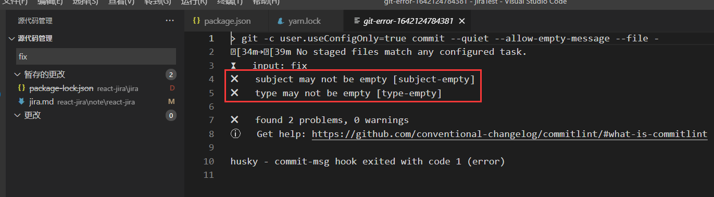
    
        - 提交的规则（fix: some message）
        
    ```
          [
            'build', 
            'chore',
            'ci',
            'docs',  // 指更新了文档
            'feat', // 指 这一次添加了新的功能
            'fix',
            'perf', // 指这一次提升了性能
            'refactor',
            'revert',
            'style',   // 改进了样式
          'test'	// 增加了测试脚本
        ];
        ```
    
      
    
    
    ​    
    
    - 


## 对比常见mock方案，配置JSON SERVER

### 常见Mock方案

- 代码侵入（直接在代码中写死Mock数据，或者请求本地的JSON文件）

  - 优点：无

  - 缺点：

    1.和其他方案比Mock效果不好

    2.与真实Server环境的切换非常麻烦，一切需要侵入代码切换环境的行为都是不好的

- 请求拦截

  - 代表：[Mock.js](https://github.com/nuysoft/Mock/wiki/Getting-Started)
    原理是重写xmlHttpRequest的一些属性，然后帮助门额返回我们想要的数据
  - 实例：
  - 优点：
    - 与前端代码分离
    - 可生成随机数据
  - 缺点：
    - 数据都是动态生成的假数据，无法真是模拟真删改查的情况
    - 只支持ajax,不支持fetch
  - 

- 接口管理工具

  - 代表：rap(阿里出品)、swagger、moco、yapi

  - 优点：

    1.配置功能强大，接口管理与Mock一体，后端修改接口Mock也跟着改，可靠

  - 缺点：
    1.配置复杂，依赖后端，可能会出现后端不愿意出手，或者等配置完了，接口也开发出来了的情况。

  - 一般会作为大团队的基础建设而存在，没有这个条件的话慎重考虑

- 本地Node服务器

  - 代表：[json-server](https://github.com/typicode/json-server)
  - 优点：
    1. 配置简单，json-server甚至可以0代码30秒启动一个REST API Server
    2. 自定义程度高，一切尽在掌握中
    3. 增删改查真是模拟
  - 缺点：
    1. 与接口管理工具相比，无法随着后端API的修改而自动修改
  - 在这2章里面会接触到不同的（GET、POST 、DELETE 、 PATCH）Mock场景，

- 

- REST API

  - 一句话总结：URI代表资源/对象, METHOD代表行为

    ```javascript
    GET /tickets  //列表
    GET /tickets/12  //详情
    POST /tickets  //增加
    PUT /tickets/12  //替换
    PATCH /tickets/12  //修改
    DELETE /tickets/12  //删除
    ```

    

### JSON SERVER使用

- 步骤（参考官网）

  ```javascript
  1. Install JSON Server
  
  	npm install -g json-server 或者 yarn add json-server -D
  
  2. Create a db.json file with some data（创建一个json文件，起名叫db.json，文件放置在跟index.html平级的目录中，也可以放置在static文件夹中，db.json文件里面的内容，是一个对象。）
  
      {
        "posts": [
          { "id": 1, "title": "json-server", "author": "typicode" }
        ],
        "comments": [
          { "id": 1, "body": "some comment", "postId": 1 }
        ],
        "profile": { "name": "typicode" }
      }
  
  3. Start JSON Server
  
  	json-server --watch db.json
  
  4. Now if you go to http://localhost:3000/posts/1, you'll get
  
  	{ "id": 1, "title": "json-server", "author": "typicode" }
  ```

  - 运行完之后会生成对应的resource，可以去postman测试一下
    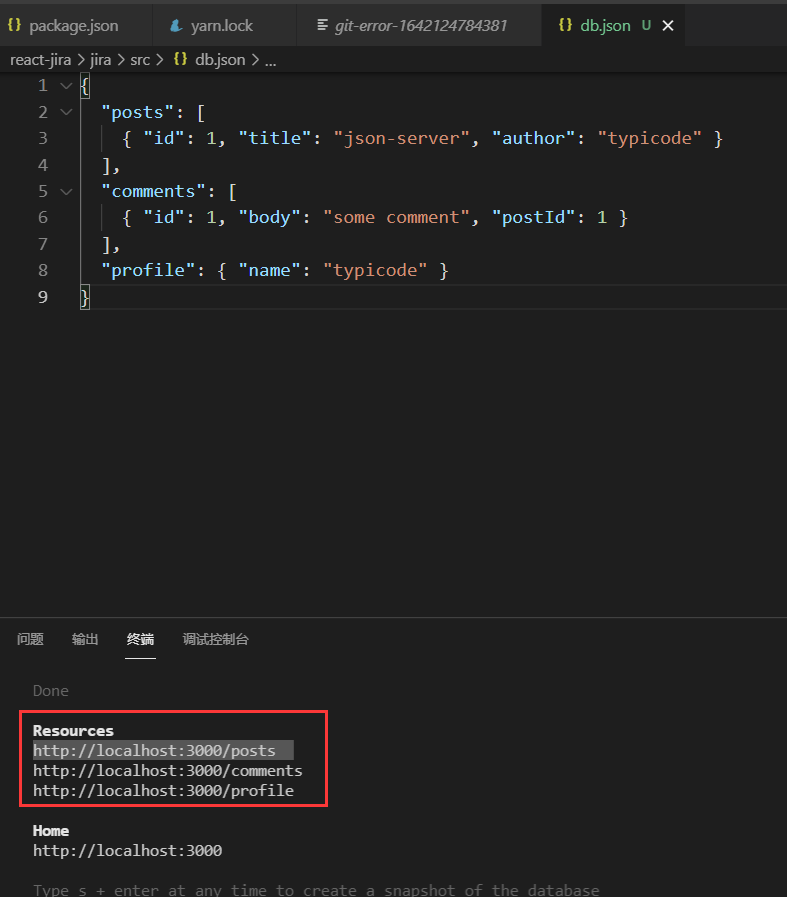

    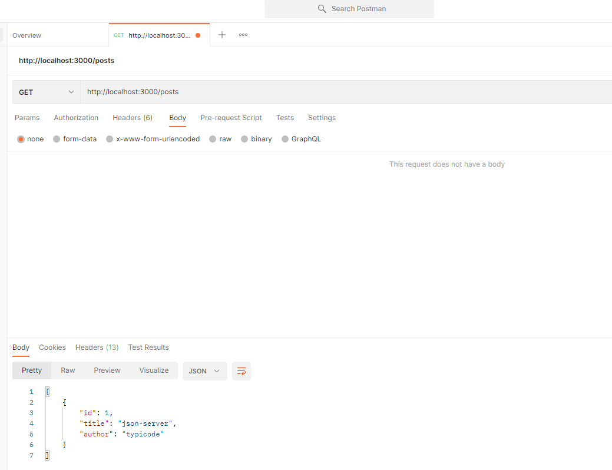

  - 

- 项目中使用

  - 创建 __json_server_mock__  文件夹 前后有两个空格，告诉看代码的人，这个文件夹和我们项目本身没什么关系，起辅助作用。创建db.json

    - value 必须是数组或者对象
      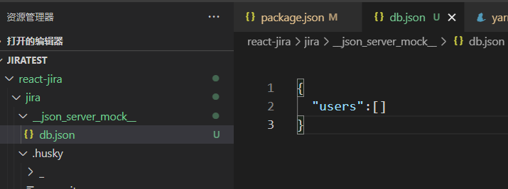

  - 然后在package.json中 scripts 下添加命令

    - "json-server":"json-server __json_server_mock__/db.json --watch"

      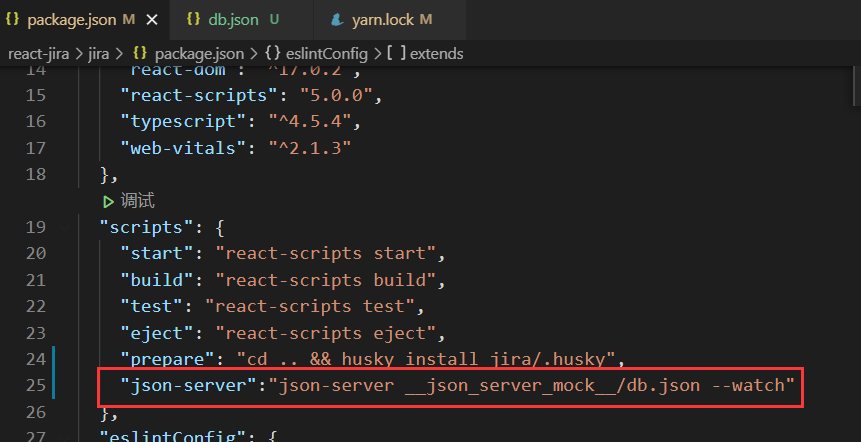

    - 尝试一下启动

      npm run json-server

    - json-server与项目运行后是一个端口，修改json-server的端口
      "json-server":"json-server __json_server_mock__/db.json --watch --port 3001"

    - 

  - 

- 


# React 自定义hook和状态提升分享组件状态


  


## 查询骑手demo

- encodeURIComponent（转义） 和 decodeURIComponent (解码)

- 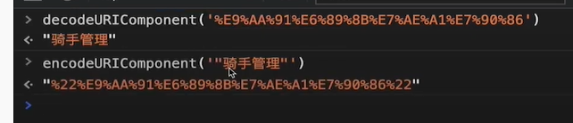
- encodeURI 可以转义整个url

- 创建对应的组件,但是search-panel组件里面的状态没有提升，根据项目名改变，请求list的接口放在了searchPanel里面，List组件如何获取呢？react文件虽然不使用React,但是一定要引入 （imort React from 'react'）

  - 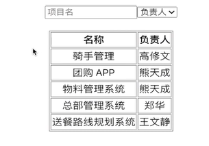

  - 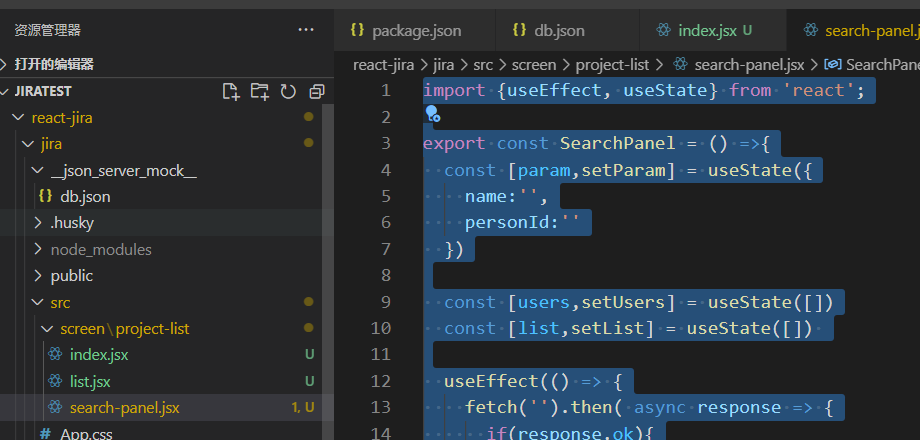

  - ```javascript
    import React from 'react';
    import {useEffect, useState} from 'react';
    
    export const SearchPanel = () =>{
      const [param,setParam] = useState({
        name:'',
        personId:''
      })
    
      const [users,setUsers] = useState([])
      const [list,setList] = useState([]) 
    
      useEffect(() => {
        fetch('').then( async response => {
          if(response.ok){
            setList(await response.json())
          }
        })
      },[param])
    
      
    
      return <form >
        <input type="text" value={param.name} onChange={evt => setParam({
          ...param,
          name:evt.target.value
        })}/>
    
        <select value={param.personId} onChange={evt => setParam({
          ...param,
          personId:evt.target.value
        })>
          <option value="">负责人</option>
          {
            users.map(user => <option value={user.id}>{user.name}</option>)
          }
        </select>
      </form>
    }
    ```

  - 

- 将子组件里面的数据提升到父组件中，再流向各个子组件。

  - index.jsx

    ```javascript
    import React from 'react';
    import {useState , useEffect} from 'react';
    import {SearchPanel} from './search-panel';
    import {List} from './list';
    
    export const ProjectListScreen = () => {
      const [param,setParam] = useState({
        name:'',
        personId:''
      })
      const [list,setList] = useState([]) 
    
      useEffect(() => {
        fetch('').then( async response => {
          if(response.ok){
            setList(await response.json())
          }
        })
      },[param])
    
      return <div>
        <SearchPanel param={param} setParam={setParam}/>
        <List/>
      </div>
    }
    ```

    

  - 

- 配置mock地址公共变量，真实请求地址和json-server请求地址

  - 在项目下创建 .env 和 .env.development文件，运行命令的时候会自动化的切换我们的环境变量

    - 项目运行npm run dev的时候会自动读取 .env文件(配置的mock接口地址)
      - 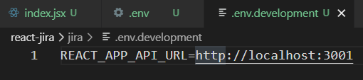
    - 项目运行npm run build的时候会自动读取 .env.development文件(配置的真实接口地址)
      - 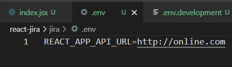

  - 替换项目中使用的mock地址

    - 使用process获取当前的环境变量

      ```javascript
      const apiUrl = process.env.REACT_APP_API_URL
      
      export const ProjectListScreen = () => {
        const [param,setParam] = useState({
          name:'',
          personId:''
        })
        const [list,setList] = useState([]) 
      
        useEffect(() => {
          fetch(`${apiUrl}/projects`).then( async response => {
            if(response.ok){
              setList(await response.json())
            }
          })
        },[param])
          ......等等
      ```

      

    - db.json文件中的数据mock完之后，需要在vscode中再开一个任务，运行mock任务，再启动项目

      - 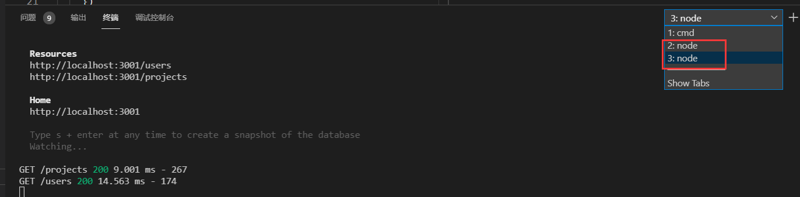

    - 

  - 


## qs 接口后面的参数用qs插件

- 

  - 步骤

    ```javascript
    yarn add qs
    ```

    

  - 使用
    `${apiUrl}/projects?qs.stringify(params)`

    fetch(`${apiUrl}/projects?${qs.stringify(param)}`)

  - 


## 学习自定义Hook,用useDebounce 减少工程搜索请求（Custom Hook）

- 用Custom Hook 提取并复用组件代码
  Custom Hook 是React中最新也是最优秀的组件代码复用方案

  目前已经使用了 useState 和useEffect 两个最基本的React自带Hook,下面会使用useMount 和 useDebounce 两个custom Hook

- 


