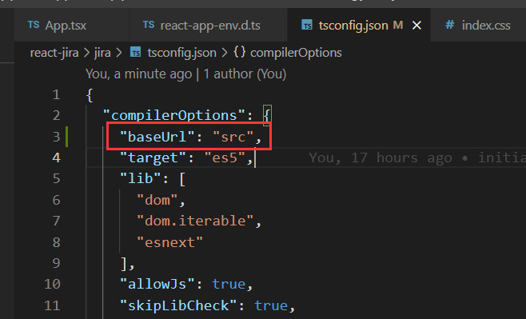
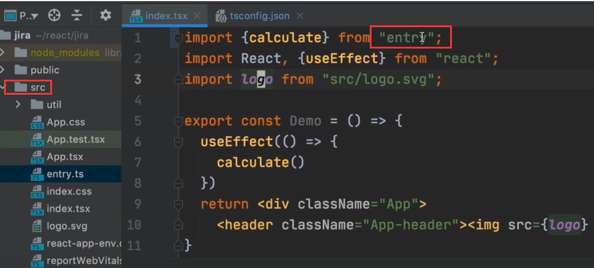
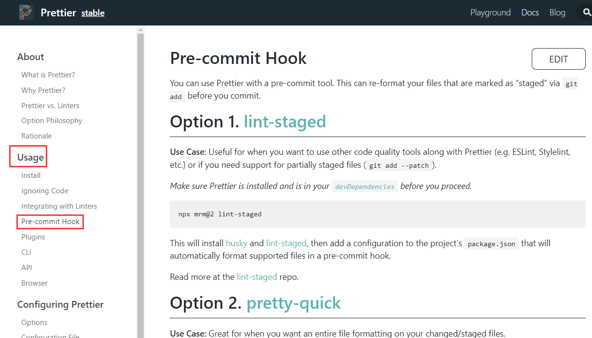
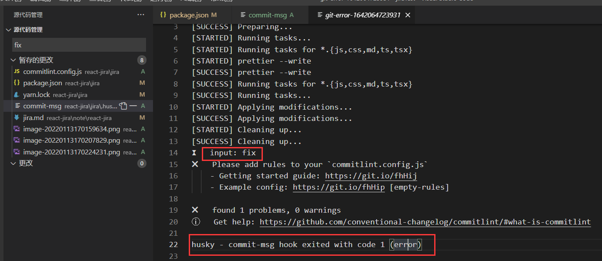

# 项目需要实现的功能

- 
- 技术栈
  - 
  - 
  - 
  - 
  - 
  - 
  - 


# 初始化项目

## 用Create React App 初始化项目

- 官网有介绍。

- 我们需要创建的是Typescript项目

  - ```javascript
    npx create-react-app jira --template typescript
    // 使用不同的包管理器创建项目，没尝试
npx create-react-app jira --template typescript --use-npm
    npx create-react-app jira --template typescript --use-npm
    ```
  ```
    
  - 使用上面命令一直报错，查了stackoverflow，找到一个解决方案。npx clear-npx-cache，再重新执行方案。
  ```
  
- scr目录

  - index.tsx文件是做一些准备工作，APP.tsx 是做app本身的东西。
  - react-app-env.d  这个是引入一些预先定义好typescrpt的类型

- public文件夹是不参与打包的，它里面包含了真正的静态文件。

- manifest 是用来做PWA的,配置PWA

- package.json是每个前端项目的入口文件


## 配置eslint、prettier和commitlint规范

### tsconfig.json配置

- compilerOptions中配置baseUrl,目的是引入文件的时候如果写了绝对路径，它会自动从配置的地址目录中找
  - 配置 compilerOptions
    
  - 我们的绝对路径会去src下面寻找
    
- 

### 如何确保编辑我们项目的人都能采用统一的格式化配置呢--prettier

- [项目中使用prettier配置链接](https://prettier.io/docs/en/install.html)

- 使用步骤

  - ```javascript
    1.安装依赖
     yarn add --dev --exact prettier
    2.新建一个配置文件，echo就是新建文件的意思
     echo {}> .prettierrc.json
    3.创建一个.prettierignore文件（不需要格式化的文件，在项目旁边悬浮的新建文件创建），并输入
        build
        coverage
    4.
    ```

  - yarn prettier --write . 是手动格式化，当然，我们希望我们的项目是自动格式化，需要借助 Pre-commit Hook,就是当我们代码提交前，就自动对其格式化。 即代码commit前，触发husky钩子，运行lint-staged命令，格式化项目。

    - 

    - 步骤 [npx mrm@2 lint-staged报错解决](https://typicode.github.io/husky/#/?id=custom-directory)，[github解决方案](https://github.com/okonet/lint-staged/issues/961)

      [eslint-config-prettier 依赖地址](https://prettier.io/docs/en/install.html#eslint-and-other-linters)

      ```javascript
      1. 安装 husky and lint-staged 依赖
      	npx mrm@2 lint-staged 
      	此命令会出现.git can't found 报错,原因是package.json文件与 .git 不在同一目录下，不同层级，参考官网提示（在步骤后面的地址中）。
      	修改package.json中scripts的prepare("prepare": "cd .. && husky install jira/.husky"),
      2. 修改scripts后，需要执行 yarn 或者 npm install,运行scripts 中的prepare,会在目录下面生成 .husky文件夹
      3.在 .husky文件夹下面新建文件 pre-commit,文件中输入以下命令 （不需要运行npx mrm@2 lint-staged 这个命令）
      	#!/bin/sh
          . "$(dirname "$0")/_/husky.sh"
          cd pathToYourProject && npx lint-staged
      4. 增加对ts、tsx文件的格式化，修改package.json中的 'lint-staged'命令
      	"*.{js,css,md,ts,tsx}": "prettier --write"	
      5. 最后一步，create react app 是自带eslint配置，在package.json 中 eslintConfig 。prettier和eslint一起工作的时候会冲突，所以需要专门对eslint配置以下，安装一下依赖。文档在prettier官网-Usage-install 目录第二条。
      	yarn add eslint-config-prettier -D 
      6.修改 eslintConfig 中的配置，添加 prettier，意思是用 prettier 覆盖了一部分原来的规则
      	"eslintConfig": {
              "extends": [
                "react-app",
                "react-app/jest",
                "prettier"
              ]
        	},
            
      	
      ```

      

    - commitlint规范 （目的是 每次 git commit的时候，对commit message进行校验，查看是否符合一定的规范，如果不符合，提交失败）

    - 配置步骤 [commitlint github文档--Getting started](https://github.com/conventional-changelog/commitlint)

      ```javascript
      1. 安装对应的系统依赖并创建文件（可以使用yarn add ）
      	# Install commitlint cli and conventional config
          npm install --save-dev @commitlint/{config-conventional,cli}
          # For Windows:
          npm install --save-dev @commitlint/config-conventional @commitlint/cli
      
          # Configure commitlint to use conventional config
          echo "module.exports = {extends: ['@commitlint/config-conventional']}" > commitlint.config.js
      2. 在husky文件夹下面创建 commit-msg文件，添加下面话或者其他，看文档
      	#!/bin/sh
          . "$(dirname "$0")/_/husky.sh"
      
          cd jira && npx --no -- commitlint --edit $1 
      3. 文档中 Shared configuration 下 config-conventional 就是 commit 的规则
      	
      ```

      - git commit 的时候报错（对应步骤第二点完成后提交）

        

        - 提交的规则（fix: some message）

          ```
          [
            'build', 
            'chore',
            'ci',
            'docs',  // 指更新了文档
            'feat', // 指 这一次添加了新的功能
            'fix',
            'perf', // 指这一次提升了性能
            'refactor',
            'revert',
            'style',   // 改进了样式
            'test'	// 增加了测试脚本
          ];
          ```

        

        

    - 

- 

